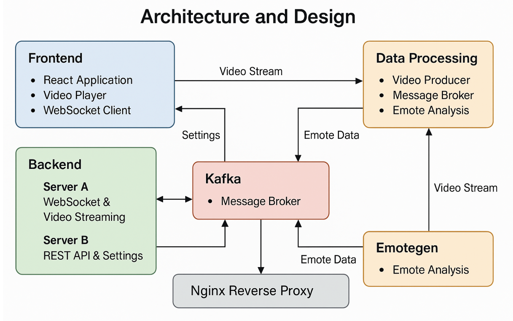
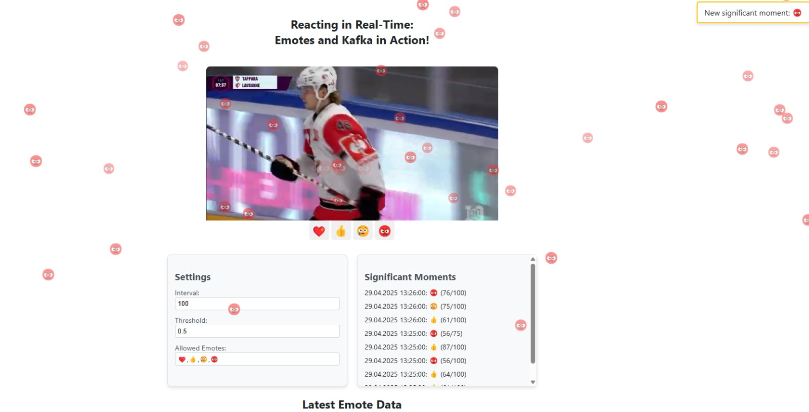
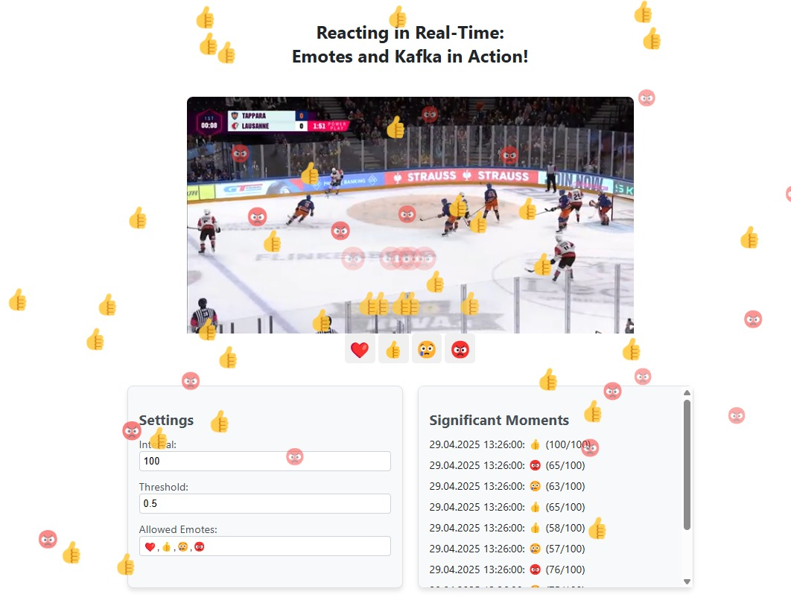
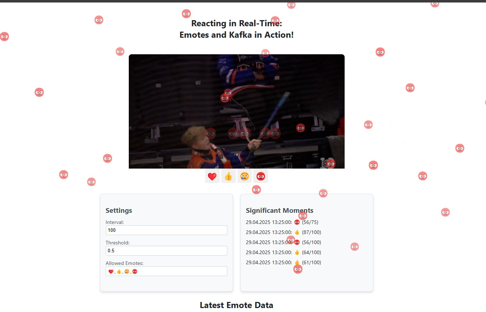
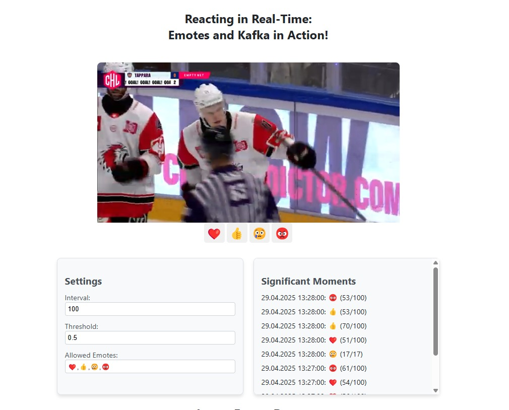

## **Summary of What We Have Done**:

* Full system architecture implemented (Frontend + Backend + Kafka)
* Dockerized all services with Docker Compose
* React frontend with WebSocket-based real-time emote visualization
* Server A handling WebSocket connections and video streaming
* Server B performing emote aggregation and REST API settings management
* Emotegen service for random emote generation
* Video Producer for live video chunk streaming
* Full documentation (Architecture + How to Run + Learnings) provided
* GitLab Issue Board used to manage tasks and track progress

## Architecture and Design

## Current State of Our Reacting in Real-Time System

### Significant moments detection

### Multiple emotes overlay

### Final gameplay reaction view

